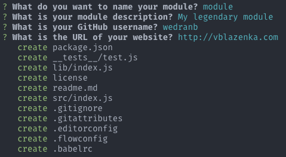

## deprecated

# generator-nome
> Scaffold out a node module with [xo](https://github.com/sindresorhus/xo) JS style linter, [Flow](https://flowtype.org/) type checking and [Jest](https://facebook.github.io/jest/) for testing

Personal generator for scaffolding npm modules.
I use xo for linting JavaScript, Flow for type checking and Jest for testing.



## Installation

First, install [Yeoman](http://yeoman.io) and generator-nome using [yarn](https://yarnpkg.com/) (we assume you have pre-installed [node.js](https://nodejs.org/)).

```bash
yarn global add yo
yarn global add generator-nome
```

Then generate your new project:

```bash
yo nome
```

There are multiple command-line options available:

```
Usage:
  yarn test                 # It will run xo, flow and jest to test your code
  yarn prepublish           # Compile code with babel from src/ to lib/ and copy type definitions from .js and create file with .flow suffix
```

Inspired by [generator-nm](https://github.com/sindresorhus/generator-nm).

## License

MIT © [Vedran Blazenka](http://vblazenka.com)
